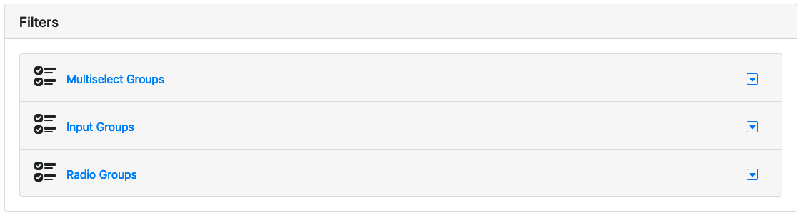
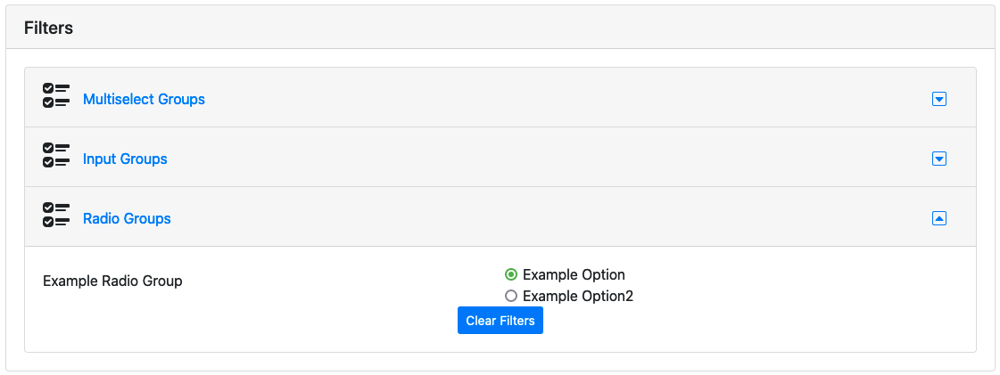
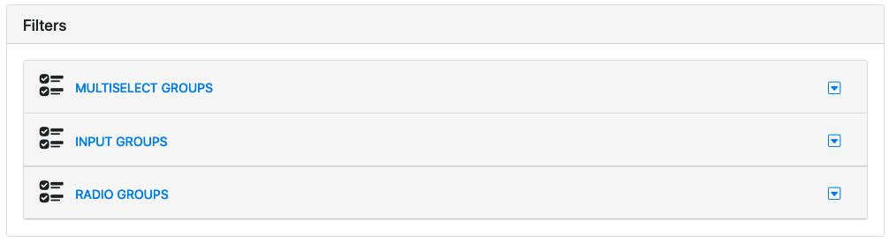
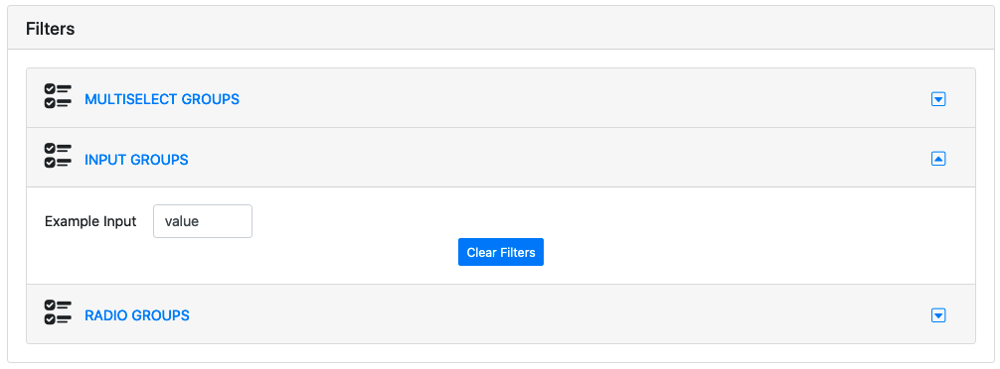

# Filter Accordion
[[toc]]
## Basic Example
A basic `<FilterAccordion>` element using [Bootstrap 4](https://getbootstrap.com/docs/4.0/components/forms/) for styling. By adding the `filterType` prop to a filter, you can specify which of the filters will appear in which section of the accordion. If `filterType` is missing or set to `'internal'`, the filter will not be included in the accordion. 

\* Please note that we are currently working on a bug that is preventing us from rendering this component in VuePress. In the meantime, we are providing screenshots so you can at least get an idea of what the component looks like.

<!-- loadDataShim is a necessary component to trigger the retrieveData function in examplePage.js -->
<loadDataShim  />





## Usage
### kebab-case
``` html
  <filter-accordion :validFilters="['exampleMultiSelect', 'exampleInput', 'exampleRadioGroup']"/>
```
### PascalCase
```html
  <FilterAccordion :validFilters="['exampleMultiSelect', 'exampleInput', 'exampleRadioGroup']"
  />
```

## Props

### validFilters
An `Array` of valid filter keys to render in the dropdowns.
* **Type**: `Array`
* **Required**: Yes

***

### mappingFunction
Function that transforms the filter type into a custom header for the associated section.
* **Type**: `Function`
* **Required**: No



#### Vue File
```js
<template>
  <div>
    <FilterAccordion
      :validFilters="['exampleMultiSelect', 'exampleInput', 'exampleRadioGroup']"
      :mappingFunction="filterMapper"
    />
  </div>
</template>
<script>
...
methods: {
  filterMapper (filterType) {
      return `${filterType.replace('_', ' ').toUpperCase()}s`
  }
}
</script>
```

***

### filterLayout
Object that specifies the layout for the internal FilterGrid components in the accordion where each key is a `filterType`.
* **Type**: `Object`
* **Required**: No



#### Vue File
```js
<template>
  <div>
    <FilterAccordion
      :validFilters="['exampleMultiSelect', 'exampleInput', 'exampleRadioGroup']"
      :mappingFunction="filterMapper"
      :filter-layout="accordionLayout"
    />
  </div>
</template>
<script>
...
data () {
  return {
    accordionLayout: {
      'Multiselect_Group': {
        columns: 2,
        labelPosition: 'vertical',
        spread: true
      },
      'Input_Group': {
        columns: 4,
        labelPosition: 'horizontal',
        spread: true
      },
      'Radio_Group': {
        columns: 4,
        labelPosition: 'horizontal',
        spread: false
      }
    }
  }
},
methods: {
  filterMapper (filterType) {
      return `${filterType.replace('_', ' ').toUpperCase()}s`
  }
}
</script>
```